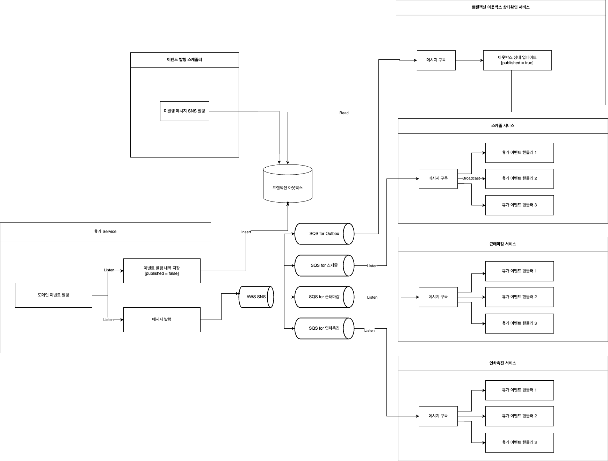

# 이벤트란
- "이벤트"는 시스템 내에서 발생한 특정 상태 변화나 행동을 의미
- 이벤트 기반 아키텍처에서 이벤트 발행은 어떤 의도를 가지고 다른 시스템의 행위를 유도하거나 호출하는 것이 아니라, 이벤트 그 자체를 의미함
  - ex) Bad - 알림 발송 이벤트 발행
  - ex) Good - 주문이 생성됨 <- 알림 시스템이 구독 후 알림 발송
- [도메인 지식 탐구를 위한 이벤트 스토밍 Event Storming](https://www.youtube.com/watch?v=hUcpv5fdCIk)

# 이벤트 기반 아키텍처의 장단점
### 장점
- 결합도 해소
  - 도메인 간 결합을 느슨하게 만듦으로써 타 도메인에 대한 의존과 영향도를 줄임.
  - 타 도메인에 대한 의존을 줄이고 각 서비스가 가진 문제를 해결을 위한 목적에 집중함으로써 강한 응집을 갖는 시스템을 만들 수 있음. Event Driven 은 이것을 가능하게 함. 
  - 타 시스템에 대한 의존을 없애기 위해선 단순히 물리적인 분리와 더불어 논리적인 분리가 필요 
    - 물리적인 분리 - HTTP를 통한 호출, 비동기 호출, 수신자에게 의도를 전달하는 MQ 메시지
    - 이벤트 기반 아키텍처가 추구해야할 방향은 '이벤트로 인해 달성하려는 목적이 아닌 이벤트 그 자체'인 것
- 비동기성
  - 이벤트 기반 아키텍처에서 이벤트는 비동기로 처리할 수 있음. 즉, 이벤트가 발생한 후 바로 처리되지 않고, 이벤트 수신자는 나중에 이를 처리할 수 있음으로 급변하는 트래픽을 보다 수월하게 통제할 수 있음 
- 확장성
  - 이벤트를 통해 여러 시스템이나 컴포넌트 간의 통합이 쉽게 이루어질 수 있음. 
  - 새로운 기능을 추가할 때, 기존 시스템을 크게 변경하지 않고도 새로운 이벤트를 구독해서 처리하는 설계를 가능하게 함.
- 분산 데이터 실시간 동기화
  - 이벤트를 메시징 시스템을 통해 전달해야만 하는가?
    - spring event만 사용할 경우 다른 인스턴스로의 전달은 불가능. 별도의 도구 활용 필요 ex) MQ, Kafka
    - MQ를 사용하지 않으면 이벤트를 발행한 인스턴스 내에서만 이벤트를 전파할 수 있지만, MQ는 분리된 타 인스턴스로 전파 가능
    - 애플리케이션 내부적으로만 이벤트를 소화한다고해도, 메시지 유실과 장애 복구를 최소화해주는 메시징 시스템의 장점을 활용하기 위해 메시징 시스템이 유리함
### 단점
- 복잡성 증가
  - 시스템이 여러 이벤트를 통해 서로 통신하는 방식으로 설계되면, 전체 시스템의 흐름을 이해하고 디버깅하는 것이 어려워질 수 있음. 
  - 이벤트가 어디서 발생하고 어디로 전달되는지에 대한 추적을 위해 시스템에서 발생할 수 있는 이벤트를 잘 관리한는 것이 중요함  
- 일관성 문제
  - 이벤트가 지연되거나 유실되면, 시스템의 상태가 불일치할 수 있음
- 장애 처리 복잡성
  - 이벤트 처리 중에 문제가 발생하면, 이를 적절하게 복구하는 것이 어려울 수 있음. 
  - 수동으로 장애가 발생한 이벤트를 재처리하거나, 보상 트랜잭션을 구현해야 하는 방식을 함께 고려해야 함.

# 메세징 솔루션
### 이벤트 발행-구독 도구 비교
- Kafka
  - 1:N
- Redis PubSub
  - 1:N
- SNS
  - 1:N
  - 100만건 까지 무료
- SQS
  - 1:1
  - 100만건 까지 무료
- Rabbit MQ
  - 1:1
### 이벤트 발행 보장 기법
- CDC
- Transactional Outbox Pattern
  - 분산 시스템에서 메시지 전달의 일관성을 보장하는 것이 목적
  - Producer는 Outbox 저장소를 활용하여 'At-Least Once Delivery' 방식으로 메시지를 발행
  - Consumer는 메시지를 중복으로 받더라도 '멱등성'있게 처리하여 일관되게 메시지를 처리함
### 메세징 솔루션 사용 시 고려사항
- 메세지 간의 발행-소비 순서가 반드시 보장되어야 함
- 중복 처리에 대한 추가 작업 필요함
  - '정확히 한 번만 전달' or
  - 멱등성 보장  or
  - 중복된 메세지 소비일 경우 처리를 막아야 함

# 분산 트랜잭션
### 원자성 보장 전략
- 개념
  - 2PC (Two Phase Commit)
  - TC/C (Try-Confirm/Cancel)
  - Saga pattern
- 로직 1 성공 && 로직 2 실패 경우 failover 전략
  - no action
  - retry - require configuring time, unit
  - publish fail event

# 추가 탐색 필요
- Zero Payload 활용 유즈케이스
- SQS Dead Letter queue 활용 유즈케이스
- SNS, SQS 속성 필터링 기능을 사용 유즈케이스
- SQS Message Group 활용만으로는 EDA 구현이 어렵나?
  - **어려움. 추후 모놀로식에서 MSA 로 전환 시, 이벤트 발행이 아니라 특정 큐에 전송해줘야 하는 형태가 됨.**
- SNS, SQS 를 모두 사용 시 어디에 FIFO 설정을 해야할까
  - https://docs.aws.amazon.com/ko_kr/sns/latest/dg/fifo-message-grouping.html
  - **둘 다**
- SNS 와 SQS Message Group 을 함께 활용하는 방법은 어떨까?
  - SNS+SQS vs SNS+SQS Message Group
  - **FIFO 큐의 순서 보장 전략에 따라 이벤트 발행 주체을 식별할 수 있는 값이 Message Group으로 설정되어야 함**
- SNS, SQS 생성 및 구독 인프라 자원 생성
  - 언제 인프라 작업이 필요할까?
    - 도메인을 별도 서버로 분리 할 때
  - 어떤 작업이 필요할까?
    - SNS 토픽 생성
    - SQS 큐 생성
    - SNS 구독에 SQS 추가
  - 도메인 서버 분리에 따른 자동화 가능?
- Transactional Outbox Pattern의 publish 플래그 true 변경 시점은?
  - **이벤트 발행 검사 전용 SQS Polling 직후**

# 설계

- 전체 흐름
  1. 로직 1 수행
  2. 이벤트 발행
  3. 이벤트 소비
  4. 로직 2 수행
- 구성 상세
- 발행자 (== 로직 1)
- 구독자 1
  - AWS의 SNS에 이벤트 발행
  - 로직 1 commit 이후에 실행 보장 필요
  - 로직 1이 정상적으로 처리되지 않으면, 이벤트는 발행되어선 안됨
- 구독자 2
  - DB에 SNS 이벤트 발행 내용 기록 (:: Transactional Outbox Pattern)
  - 구독자 1에서 이벤트 발행요청이 HTTP 통신으로 이루어지기 때문에, 실패 가능성을 대비해야 함.
  - 구독자 1에서 이벤트 발행요청이 실패할 경우, 5분 간격으로 스케줄러가 돌며 재발행
- 로직 1 - 트랜잭션 1
- 로직 2 - 트랜잭션 2
